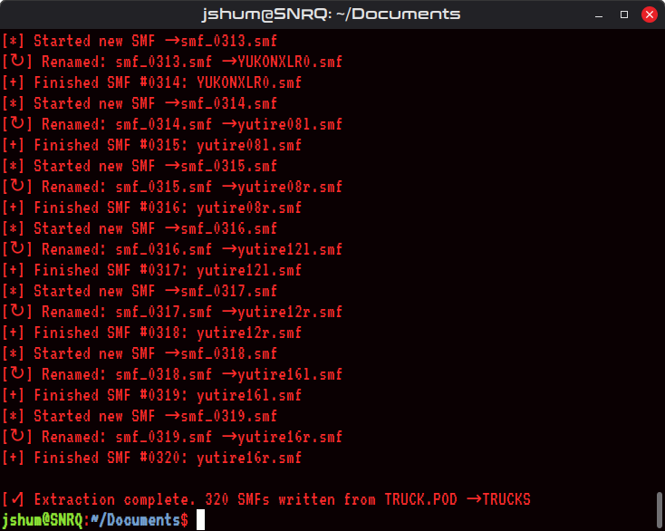
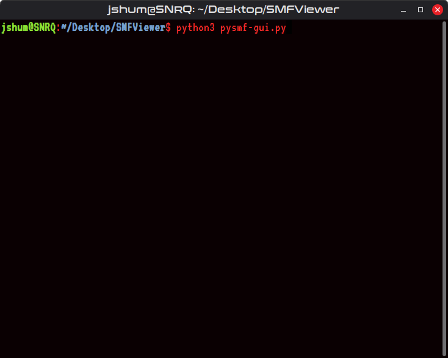
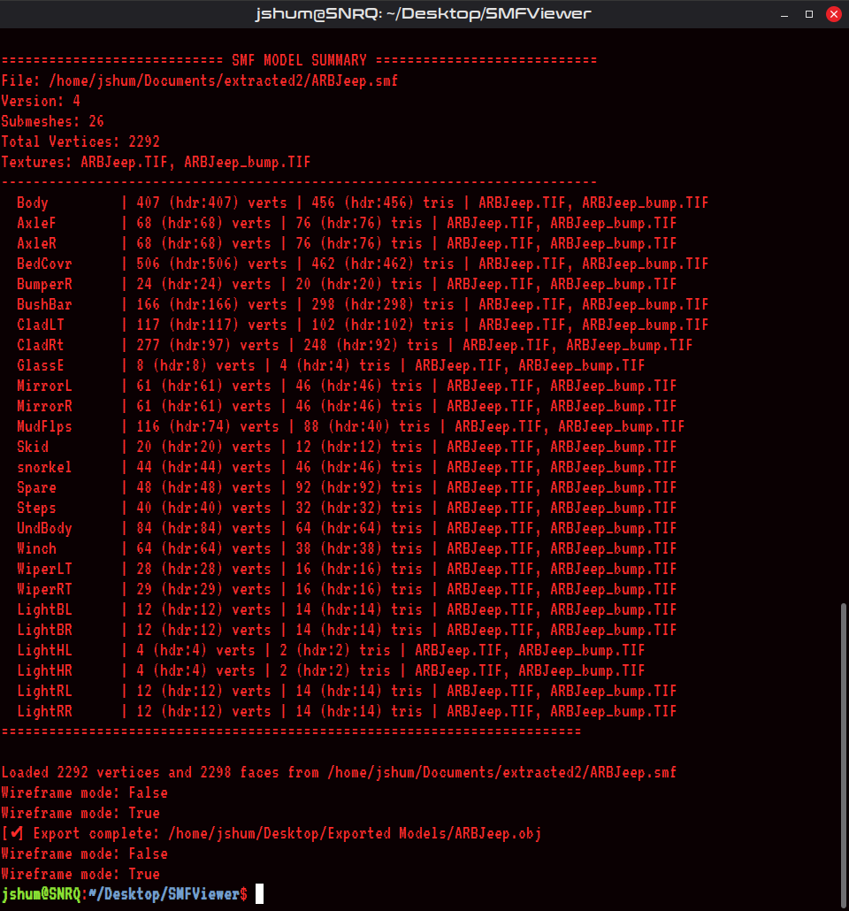

# 🧭 Python-SMF Toolkit
**Author:** Johnny Shumway (jShum00)
**License:** MIT
**Version:** 1.32

A reverse-engineered Python toolkit for viewing, parsing, and exporting
**Terminal Reality .SMF model files** used in classic games like *4x4 Evolution* and *4x4 Evolution 2*.

This toolkit includes:
- **`POD-2-SMF.py`** – simple SMF extractor, pull SMF files from POD archives using CLI.
- **`pysmf.py`** – robust SMF parser (extracts vertices, faces, textures, and submeshes)
- **`pysmf-gui.py`** – interactive OpenGL viewer using PyGame + Tkinter
- **`pysmf_export.py`** – multi-object OBJ exporter (Blender compatible)
- **`pysmf_print.py`** – formatted model summary printer

---

## 🚀 Features
- Loads and displays `.SMF` models in real time
- Supports textured and wireframe viewing
- Automatically finds matching `.TIF` / `.TIFF` textures in `../ART` when available
- Orbiting camera (arrow keys)
- Grouped, scrollable mesh tree with per-submesh visibility toggles
- Right-side inspector for selected submeshes
- Preserves and exposes the unknown 5-value material tuple stored near each `v1` block
- Shows model-wide material tuple grouping to help compare repeated patterns across submeshes
- Direct export to multi-object `.OBJ`
- Human-readable SMF data summary printed to console

---

## 📸 Screenshots

Below are various stages of the **PySMF Viewer** and parser workflow — from command-line inspection to full 3D visualization and export.

### POD -> SMF Extractor<br />
**Extract the SMF files from the POD files in the game directory.**


### Initial Folder<br />
**Viewing parsed file structure**<br />


### Command Line Tools<br />
**How to run it:**<br />


**The Model Summary:**<br />


### Graphical Viewer (PySMF GUI)<br />
**Initial launch — OpenGL grid and controls**<br />


**SMF file loader in action**<br />


**Loaded vehicle model (wireframe)**<br />


**Solid fill rendering mode**<br />


**SMF export utility**<br />


### Integration & Workflow - Blender<br />


---

## 🖥️ Requirements
Create and activate a virtual environment in the project directory, then install dependencies:
```bash
python3 -m venv venv
source venv/bin/activate
pip install -r requirements.txt
```
Tkinter comes pre-installed with most Python distributions.
Tested on Python 3.10+ (Linux).

---

## 🎮 Controls

**Keyboard:**

Key             | Action
----------------|--------------------------------------------
`O`             | Open .SMF file
`E`             | Export current model to .OBJ
`W`             | Toggle wireframe/solid
`M`             | Toggle texture view
`← / →`        | Orbit camera left/right
`Numpad +/-`    | Zoom in/out
`ESC`           | Exit Viewer

**Mouse / UI:**
- Click group arrows in the left sidebar to expand/collapse mesh groups
- Click mesh rows to select a submesh
- Click eye icons to hide/show individual submeshes
- Use the mouse wheel or scrollbar to scroll the grouped mesh tree
- Click material fields in the inspector to edit them
- Press `Enter` in an active field to commit it to the **heuristic** live preview

---

## 🖼️ Viewer Layout
The GUI uses a multi-panel layout:

- **Top toolbar:** `Open`, `Export`, `Wireframe`, `Texture`, `Exit`, `Opacity`
- **Left sidebar:** grouped mesh tree with expand/collapse arrows and eye toggles
- **Center viewport:** OpenGL model view
- **Right inspector:** selected-submesh details, material tuple research, and heuristic preview state
- **Bottom status strip:** current file, wireframe state, texture state, assumed opacity state, visible-submesh count

The main window is resizable and uses native OS maximize/minimize controls.

---

## 📁 File Overview

**`pysmf.py`**

The main parser.
Reads `.SMF` files, reconstructs submeshes, textures, and geometry. Treats `v1`, `v2`, etc. as mesh-section markers rather than submesh names.

**`pysmf-gui.py`**

OpenGL viewer built with PyGame and PyOpenGL.
Uses an orbit camera, grid, grouped mesh sidebar, right-side inspector, and texture rendering.

**`pysmf_export.py`**

Converts `.SMF` → `.OBJ`, keeping each submesh as a distinct object.
Produces clean, Blender-importable geometry.

**`pysmf_print.py`**

Prints structured summary data to the console automatically when models are loaded:

```yaml
============================ SMF MODEL SUMMARY ============================
File: GMCJimmy.smf
Version: 4
Submeshes: 25
Total Vertices: 1837
Textures: GMCJimmy.TIF, GMCJimmy_bump.TIF
---------------------------------------------------------------------------
  Body         |      427 (hdr:427) verts |      538 (hdr:538) tris | GMCJimmy.TIF, GMCJimmy_bump.TIF
  AxleR        |       68 (hdr:68) verts  |       76 (hdr:76) tris  | GMCJimmy.TIF, GMCJimmy_bump.TIF
=========================================================================
```

---

## 🔬 Experimental Material Research

The viewer treats the 5-value line after a `v1` marker as **research data**, not settled truth.

For example:
```text
1,1,64,0,1,4RUNNERLTD.TIF
```

What PySMF does with this today:
- Preserves the raw 5 values exactly
- Shows them in the inspector
- Groups matching tuples across the model
- Allows session-only editing
- Offers a **heuristic preview** path for experimentation

What PySMF does **not** claim yet:
- The final semantics of each field
- Exact parity with the game's renderer
- Correct transparency/material behavior for all models

The `Opacity` toolbar toggle controls whether the viewer uses the current SMF-based heuristic opacity assumptions or renders textured meshes without those assumed alpha adjustments.

**Current heuristic assumptions (intentionally conservative):**
- `Value 2` is treated as an opacity multiplier
- `Value 4` and `Value 5` are treated as local transparency-related toggles
- `Value 1` and `Value 3` are preserved and shown, but not strongly interpreted yet

---

## 🗂️ Mesh Grouping

The viewer auto-groups obvious name families in the sidebar:

- `Fog*` → `Foglights`
- `Glass*` → `Glass`
- `Light*` → `Lights`
- `Mirror*` → `Mirrors`
- `Wiper*` → `Wipers`
- everything else → `Other`

These groups are UI-only and do not change parsing or export behavior.

---

## 🔧 Example Usage
Run the viewer:
```bash
python3 pysmf-gui.py
```
Standalone export:
```bash
python3 pysmf_export.py
```
Print model summary only:
```bash
python3 pysmf_print.py
```

---

## 🧠 Notes
- The `.SMF` format was used by Terminal Reality's EVO engine (circa 2000s).
- Models may have non-centered origins — this viewer recenters them automatically.
- Bump map references are preserved as filenames, but the viewer does not implement real bump mapping.
- TIFF image alpha is used in the viewer when texture rendering is enabled.
- The inspector and grouped material analysis are designed to help the community infer the format more accurately over time.

---

## 🧬 Credits
Reverse engineering, parser design, and viewer by Johnny Shumway (jShum00).
Inspired by Terminal Reality's original EVO engine file formats.

---

## 📜 License
This project is licensed under the MIT License — free for learning, modification, and redistribution.

# The MIT License (MIT)
Copyright © 2025 **Johnny Shumway**

Permission is hereby granted, free of charge, to any person obtaining a copy of this software and associated documentation files (the "Software"), to deal in the Software without restriction, including without limitation the rights to use, copy, modify, merge, publish, distribute, sublicense, and/or sell copies of the Software, and to permit persons to whom the Software is furnished to do so, subject to the following conditions:

The above copyright notice and this permission notice shall be included in all copies or substantial portions of the Software.

THE SOFTWARE IS PROVIDED "AS IS", WITHOUT WARRANTY OF ANY KIND, EXPRESS OR IMPLIED, INCLUDING BUT NOT LIMITED TO THE WARRANTIES OF MERCHANTABILITY, FITNESS FOR A PARTICULAR PURPOSE AND NONINFRINGEMENT. IN NO EVENT SHALL THE AUTHORS OR COPYRIGHT HOLDERS BE LIABLE FOR ANY CLAIM, DAMAGES OR OTHER LIABILITY, WHETHER IN AN ACTION OF CONTRACT, TORT OR OTHERWISE, ARISING FROM, OUT OF OR IN CONNECTION WITH THE SOFTWARE OR THE USE OR OTHER DEALINGS IN THE SOFTWARE.