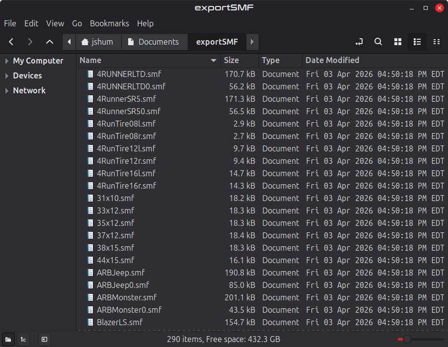
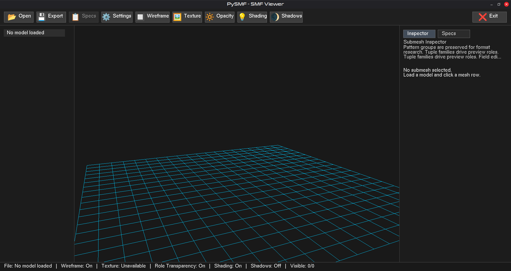
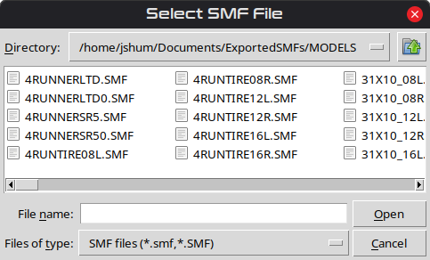
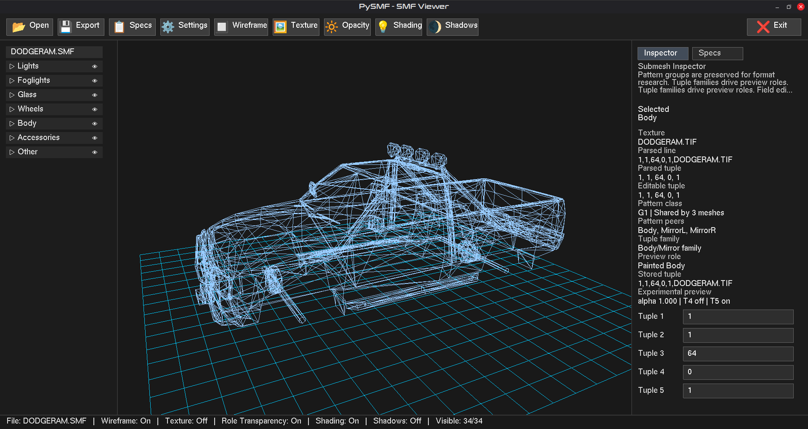
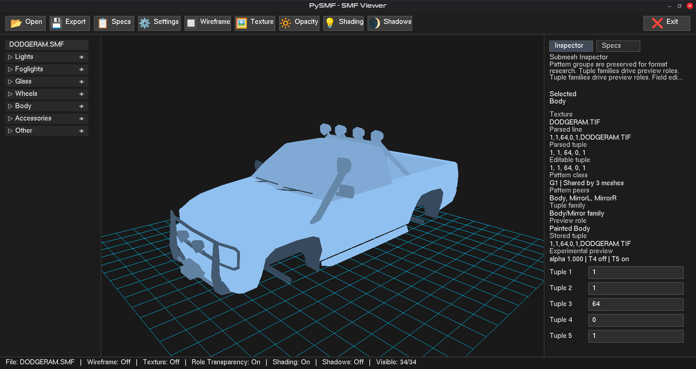
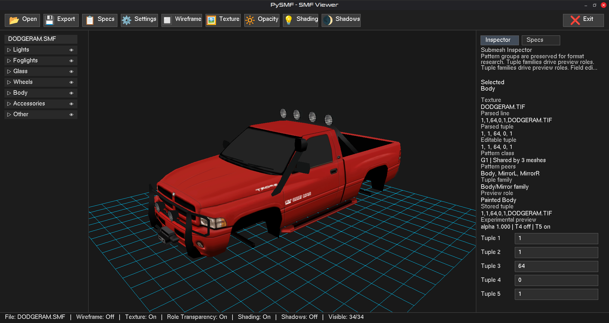
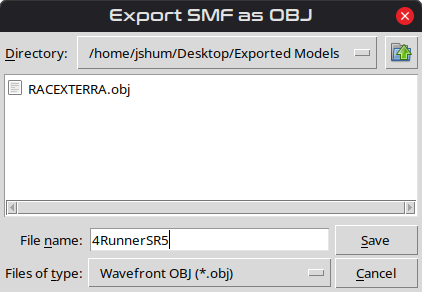
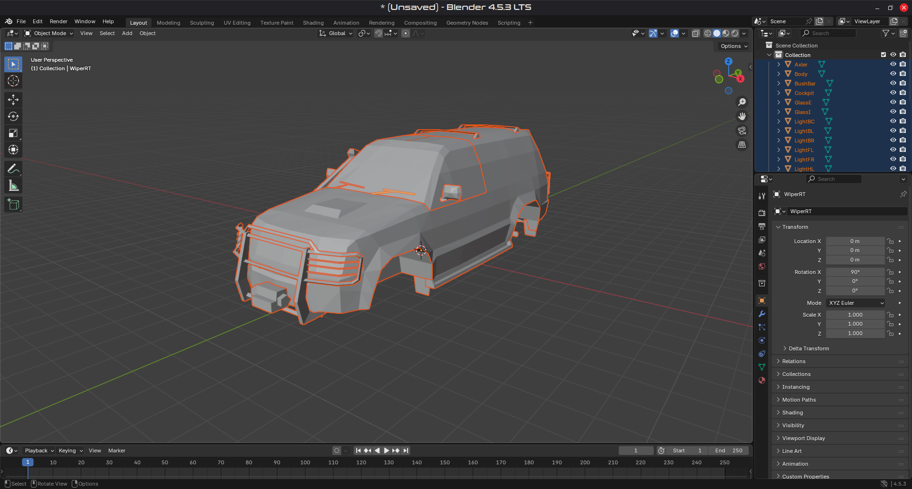

# 🧭 Python-SMF Toolkit
**Author:** Johnny Shumway (jShum00)
**License:** MIT
**Version:** 1.32

A reverse-engineered Python toolkit for viewing, parsing, inspecting, and exporting
**Terminal Reality `.SMF` model files** used in games such as *4x4 Evolution* and *4x4 Evolution 2*.

This repository includes:
- **`POD-2-SMF.py`** – command-line extractor for pulling `.SMF` files from POD archives
- **`pysmf.py`** – defensive SMF parser for headers, submeshes, textures, vertices, faces, and material tuples
- **`pysmf-gui.py`** – OpenGL viewer with grouped mesh controls, inspector, settings, and TRK/specs integration
- **`pysmf_export.py`** – Wavefront OBJ exporter that preserves submesh boundaries
- **`pysmf_print.py`** – formatted CLI summary printer
- **`pysmf_gui_*.py`** – support modules for materials, prepared render data, TRK parsing, and shared viewer types

---

## 🚀 Features
- Loads `.SMF` models and renders them in real time with PyGame + PyOpenGL
- Parses identifier-like submesh names while treating `v1`, `v2`, etc. as mesh-section markers
- Preserves per-submesh material tuples and exposes them in the inspector for research
- Supports wireframe, textured rendering, heuristic opacity preview, shading, and projected ground shadows
- Uses a grouped, scrollable mesh tree with per-group and per-submesh visibility toggles
- Provides an inspector pane with live preview fields and model-wide tuple-family grouping
- Resolves matching `.TRK` vehicle data via `trk_map.json` and displays specs in the right pane
- Looks for matching `.TIF` / `.TIFF` textures in the configured texture directory or `../ART`
- Saves preferred SMF / TRK / texture directories to `viewer_settings.json`
- Exports loaded models to multi-object `.OBJ`
- Prints human-readable model summaries from the CLI

---

## 📸 Screenshots

Below are various stages of the **PySMF Viewer** and parser workflow, from extraction to interactive inspection and export.

### POD -> SMF Extractor<br />
**Extract the SMF files from a POD archive.**
```bash
python3 POD-2-SMF.py ../4x4Evo2/TRUCK.POD ../exportSMF/
```

> Note: To export both textures (`*.TIF`) and models (`*.SMF`) from game assets, use my other tool PyPOD, available [here](https://github.com/JShum00/PyPOD).

### Initial Folder<br />
**Viewing parsed file structure**<br />


### Command Line Tools<br />
**Launch the GUI:**<br />
```bash
python3 pysmf-gui.py
```

**Print a model summary from Python:**<br />
```python
from pysmf_print import print_smf_summary

print_smf_summary("/path/to/model.smf")
```

### Graphical Viewer (PySMF GUI)<br />
**Initial launch — OpenGL grid and controls**<br />


**SMF file loader in action**<br />


**Loaded vehicle model (wireframe)**<br />


**Solid fill rendering mode**<br />


**Texture rendering mode**<br />


**SMF export utility**<br />


### Integration & Workflow - Blender<br />


---

## 🖥️ Requirements
Create and activate a virtual environment in the project directory, then install dependencies:

```bash
python3 -m venv venv
source venv/bin/activate
pip install -r requirements.txt
```

Tested on Python 3.12+ (Linux). The GUI also expects a working OpenGL environment.

---

## ▶️ Usage

### GUI
```bash
python3 pysmf-gui.py
```

### POD extraction
```bash
python3 POD-2-SMF.py /path/to/archive.POD /path/to/output_dir
```

### OBJ export helper
```bash
python3 pysmf_export.py
```

The GUI uses in-app overlay dialogs for opening `.SMF`, choosing `.TRK`, selecting textures, changing settings, and exporting `.OBJ`.

---

## 🎮 Controls

**Keyboard:**

Key             | Action
----------------|--------------------------------------------
`O`             | Open `.SMF` file
`E`             | Export current model to `.OBJ`
`S`             | Switch right pane to vehicle specs
`W`             | Toggle wireframe / solid fill
`M`             | Toggle texture view
`L`             | Toggle shading
`H`             | Toggle projected shadows
`← / →`         | Orbit camera left / right
`↑ / ↓`         | Zoom in / out at standard speed
`CTRL + ← / →`  | Orbit camera left / right at 2x speed
`CTRL + ↑ / ↓`  | Zoom in / out at 2x speed
`Numpad +/-`    | Zoom in / out
`TAB`           | Advance to the next active material field in the inspector
`Enter`         | Commit the active material field to the heuristic preview
`SPACE`         | Legacy no-op
`ESC`           | Exit viewer

**Mouse / UI:**
- Hold middle-click and drag to orbit the camera freely in yaw / pitch
- Hold right-click and drag left / right to orbit the camera with cursor grab
- Use the mouse wheel to zoom the camera, or to scroll hovered panels
- Click group arrows in the left sidebar to expand / collapse mesh groups
- Click eye icons to hide / show entire groups or individual submeshes
- Click a mesh row to select it in the inspector
- Use the `Specs` toolbar button or pane tabs to switch between inspector and vehicle specs
- Use the `Settings` toolbar button to configure default SMF / TRK / texture directories
- Click material fields in the inspector to edit session-only tuple values

---

## 🖼️ Viewer Layout
The GUI uses a multi-panel layout:

- **Top toolbar:** `Open`, `Export`, `Specs`, `Settings`, `Wireframe`, `Texture`, `Opacity`, `Shading`, `Shadows`, `Exit`
- **Left sidebar:** grouped mesh tree with expand / collapse arrows and visibility toggles
- **Center viewport:** OpenGL model view
- **Right pane:** tabbed submesh inspector and vehicle specs view
- **Bottom status strip:** current file, render toggles, and visible-submesh count

The main window is resizable and uses native OS minimize / maximize controls.

---

## 📁 File Overview

**`pysmf.py`**  
Core parser for `.SMF` files. Extracts headers, format version, submesh blocks, textures, vertices, faces, and the preserved 5-value material tuple.

**`pysmf-gui.py`**  
Main viewer application. Manages rendering, layout, in-app dialogs, settings persistence, texture loading, TRK resolution, and input handling.

**`pysmf_export.py`**  
Exports parsed SMF data to Wavefront `.OBJ`, writing each submesh as its own `o` block.

**`pysmf_print.py`**  
Prints a concise model summary with parsed counts and texture references.

**`pysmf_gui_materials.py`**  
Groups exact tuple patterns and derives coarse render roles for the viewer preview path.

**`pysmf_gui_model.py`**  
Builds cached NumPy render data, averaged normals, lighting factors, and model metrics.

**`pysmf_gui_trk.py`**  
Loads `trk_map.json`, resolves candidate `.TRK` files, and parses the subset of fields shown in the Specs pane.

**`pysmf_gui_types.py`**  
Shared viewer type definitions and sidebar grouping rules.

**`trk_map.json`**  
Repository-tracked mapping from model basenames to one or more TRK filenames used by the Specs view.

**`viewer_settings.json`**  
Optional local settings file created by the GUI when you save preferred browse directories.

---

## 🔬 Experimental Material Research

The viewer treats the 5-value line after a `v1` marker as **research data**, not settled truth.

Example:
```text
1,1,64,0,1,4RUNNERLTD.TIF
```

What PySMF does with this today:
- Preserves the raw 5 values exactly
- Stores the associated texture filename and raw source line
- Shows tuple values in the inspector
- Groups exact tuples across the model
- Allows session-only editing for heuristic preview work

What PySMF does **not** claim yet:
- The final semantics of each field
- Exact parity with the original game renderer

See [AboutSMF.md](AboutSMF.md) for the current format notes and reverse-engineering summary.
- Correct transparency/material behavior for all models

The `Opacity` toolbar toggle controls whether the viewer uses the current SMF-based heuristic opacity assumptions or renders textured meshes without those assumed alpha adjustments.

**Current heuristic assumptions (intentionally conservative):**
- `Value 2` is treated as an opacity multiplier
- `Value 4` and `Value 5` are treated as local transparency-related toggles
- `Value 1` and `Value 3` are preserved and shown, but not strongly interpreted yet

---

## 🗂️ Mesh Grouping

The viewer auto-groups obvious name families in the sidebar:

- `Fog*` → `Foglights`
- `Glass*` → `Glass`
- `Light*` → `Lights`
- `Mirror*` → `Mirrors`
- `Wiper*` → `Wipers`
- everything else → `Other`

These groups are UI-only and do not change parsing or export behavior.

---

## 🔧 Example Usage
Run the viewer:
```bash
python3 pysmf-gui.py
```
Standalone export:
```bash
python3 pysmf_export.py
```
Print model summary only:
```bash
python3 pysmf_print.py
```

---

## 🧠 Notes
- The `.SMF` format was used by Terminal Reality's EVO engine (circa 2000s).
- Models may have non-centered origins — this viewer recenters them automatically.
- Bump map references are preserved as filenames, but the viewer does not implement real bump mapping.
- TIFF image alpha is used in the viewer when texture rendering is enabled.
- The inspector and grouped material analysis are designed to help the community infer the format more accurately over time.

---

## 🧬 Credits
Reverse engineering, parser design, and viewer by Johnny Shumway (jShum00).
Inspired by Terminal Reality's original EVO engine file formats.

---

## 📜 License
This project is licensed under the MIT License — free for learning, modification, and redistribution.

# The MIT License (MIT)
Copyright © 2025 **Johnny Shumway**

Permission is hereby granted, free of charge, to any person obtaining a copy of this software and associated documentation files (the "Software"), to deal in the Software without restriction, including without limitation the rights to use, copy, modify, merge, publish, distribute, sublicense, and/or sell copies of the Software, and to permit persons to whom the Software is furnished to do so, subject to the following conditions:

The above copyright notice and this permission notice shall be included in all copies or substantial portions of the Software.

THE SOFTWARE IS PROVIDED "AS IS", WITHOUT WARRANTY OF ANY KIND, EXPRESS OR IMPLIED, INCLUDING BUT NOT LIMITED TO THE WARRANTIES OF MERCHANTABILITY, FITNESS FOR A PARTICULAR PURPOSE AND NONINFRINGEMENT. IN NO EVENT SHALL THE AUTHORS OR COPYRIGHT HOLDERS BE LIABLE FOR ANY CLAIM, DAMAGES OR OTHER LIABILITY, WHETHER IN AN ACTION OF CONTRACT, TORT OR OTHERWISE, ARISING FROM, OUT OF OR IN CONNECTION WITH THE SOFTWARE OR THE USE OR OTHER DEALINGS IN THE SOFTWARE.
